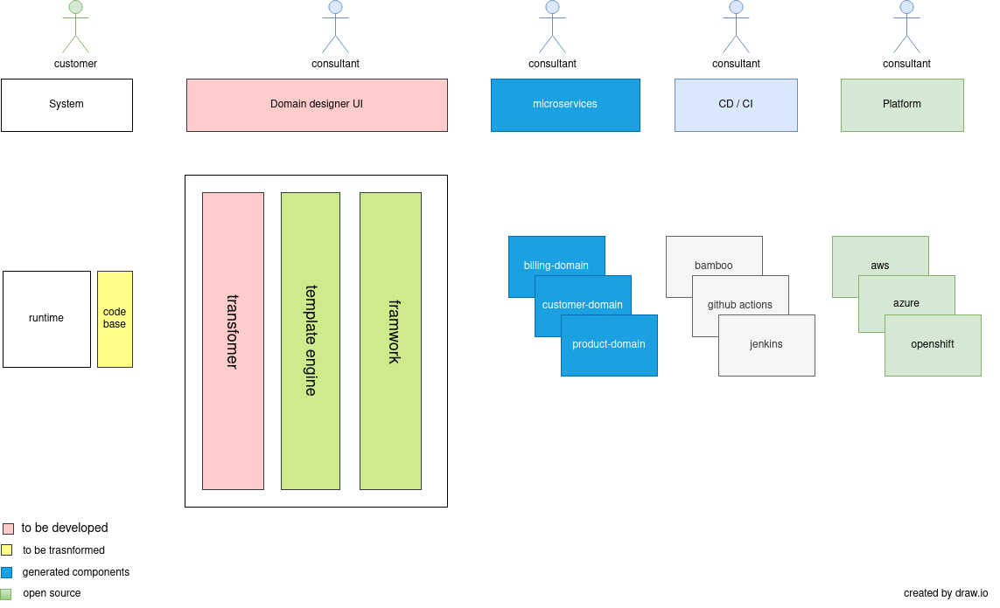
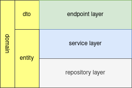

# Business case
Business case is to transform form a monolithic application to a microservice architecture.

## Monolith to Microservice
[monolith](src/main/resources/static/images/monolith.png)

## Oracle Service Bus
First phase is to transform Oracle Service Bus projects into Spring boot microservices

## Microservice Architecture

## Microservice communication

## Microservice packaging

