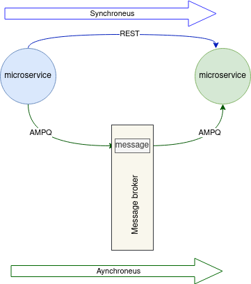
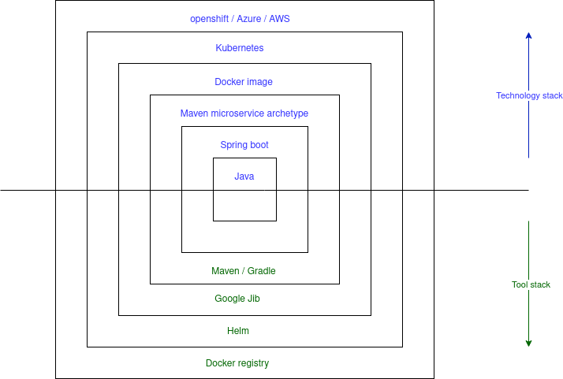

# Business case
Business case is to transform form a monolithic application to a microservice architecture.

## High Level Estimate

- Design a generic template definition to be used in the transformation phase from one programming language to another. 
- Analyse, design and implement module for transform OSB project XML files over to the generic programming language definition
  - Tool for easy split into domain 
- Design and implement module for transforming from generic programming definition to microservice
- Design and implement template for spring boot microservice application

## Monolith to Microservice

### Transformation

#### Oracle Service Bus
First phase is to transform Oracle Service Bus projects into Spring boot microservices

## Microservice Architecture
Loose coupling is one of the most important principles in a good microservice architecture.

## Microservice communication
Microservices loosely coupled and use both synchronous or asynchronous communication between each others.
AMPQ is used for asynchronous communication, where json is used as message format.
Synchronous communication is typically based on REST services.

## Microservice packaging
Microservice should be loosely coupled to the platform and environment.

## Microservice cloud ready

### Docker
Docker works by providing a standard way to run your code. Docker is an operating system for containers.

### Helm
Helm is a package manager for Kubernetes. It allows you to package and release applications as tarballs (called charts) into a versioned repository and then lets you install, upgrade or remove the apps.
